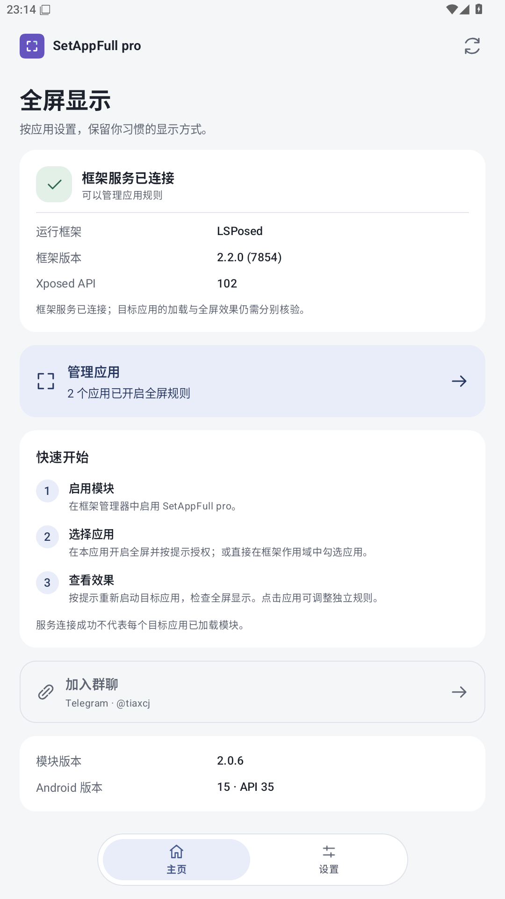
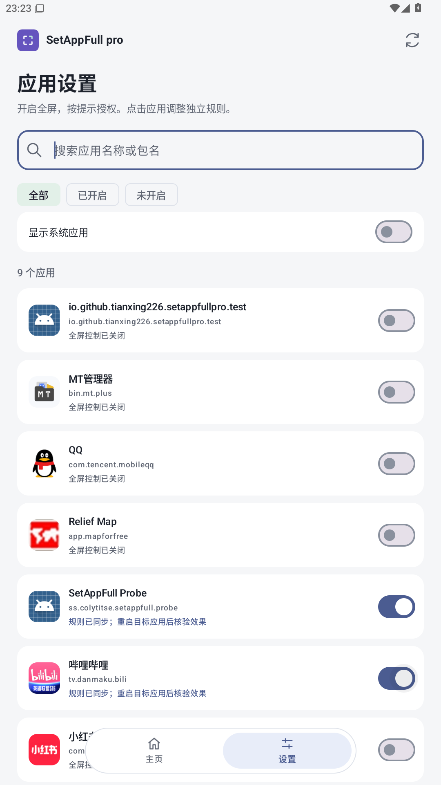
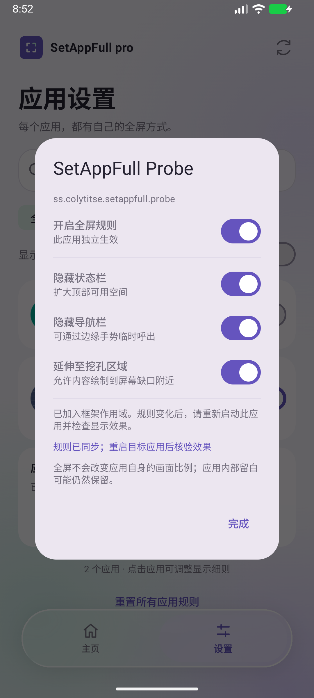

# SetAppFull pro

[简体中文](README.md) | [English](README_EN.md)

按应用设置**沉浸式全屏**的 Android 模块，让状态栏、导航栏和屏幕挖孔区域按你的需要显示。支持现代 LSPosed / libxposed API 101、102。

**[下载正式版 APK](https://github.com/tianxing226/SetAppFull-pro/releases/latest)** · [Telegram 频道](https://t.me/tiaxcj) · [验证说明](docs/VERIFICATION.md)

本项目是 [cokkeijigen/SetAppFull](https://github.com/cokkeijigen/SetAppFull) 的独立维护分支，不是原作者发布的版本。

## 能做什么

- **按应用开启全屏**：为每个应用单独保存规则，随时开启或关闭。
- **隐藏系统栏**：分别控制状态栏、导航栏，获得沉浸式显示（immersive fullscreen）。
- **使用挖孔区域**：允许窗口内容延伸至屏幕缺口区域，实际效果取决于应用和系统。
- **查看框架状态**：主页显示框架连接状态、版本与 API；设置中查看规则和作用域同步情况。
- **快速找到应用**：支持搜索、筛选和显示系统应用；启动时检查应用列表访问，支持的系统会申请所需权限。
- **简洁界面**：底部“主页 / 设置”液态玻璃导航，支持深浅色主题；

全屏规则调整的是系统栏与窗口显示区域，不能保证消除应用自身的黑边，也不会强制拉伸画面或修改比例。

## 手机界面

以下为 **2.0.1** 在 Android 17 **手机模拟器**中的实际截图，展示主页和规则设置界面，不代表新包名版本的测试结果；Probe 是随源码提供的测试应用。

<table>
  <tr>
    <td align="center">主页与框架状态</td>
    <td align="center">应用列表与筛选</td>
    <td align="center">单个应用的全屏规则</td>
  </tr>
  <tr>
    <td></td>
    <td></td>
    <td></td>
  </tr>
</table>

## 怎么使用

需要 **Android 11 或更新版本**，以及已安装并正常工作的现代 LSPosed / libxposed 兼容框架（API 101 或 102）。仅安装 APK 不会让其他应用自动全屏。

1. 下载 APK 并安装，在框架管理器中启用 **SetAppFull pro**。
2. 打开主页，检查框架连接状态；到“设置”中找到目标应用。
3. 授予该应用作用域，开启全屏并选择需要的系统栏、缺口规则。
4. 重新启动目标应用，检查实际效果。关闭规则并重新启动可恢复默认显示。

标准 Android 的应用列表权限在安装时授予，不会额外弹窗；部分厂商系统需要单独授权。列表不完整时，可在设置页打开系统权限设置。

**从 2.0.2 起使用独立包名 `io.github.tianxing226.setappfullpro`。** 

## 兼容与验证

2.0.2 的新包名验证结果以 [验证说明](docs/VERIFICATION.md) 为准。

多窗口、画中画和浮动窗口会暂停全屏策略，输入法出现时会释放导航栏控制。Android 11 / 12 使用简化导航效果。

## 源码与致谢

- [构建与维护说明](MODERNIZATION.md) · [2.0.2 更新说明](RELEASE-2.0.2.md)
- 上游：[cokkeijigen/SetAppFull](https://github.com/cokkeijigen/SetAppFull)，保留原作者归属，采用 [AGPL-3.0](LICENSE) 许可证。
- 液态玻璃：[Kyant0/AndroidLiquidGlass](https://github.com/Kyant0/AndroidLiquidGlass) / Backdrop。
- 其他依赖及许可见 [第三方声明](THIRD_PARTY_NOTICES.md)。
